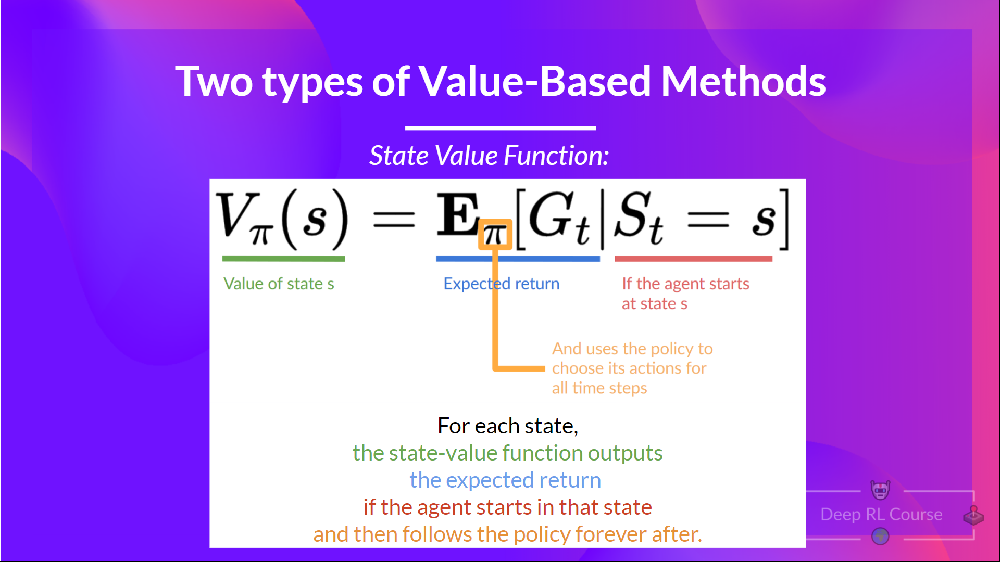
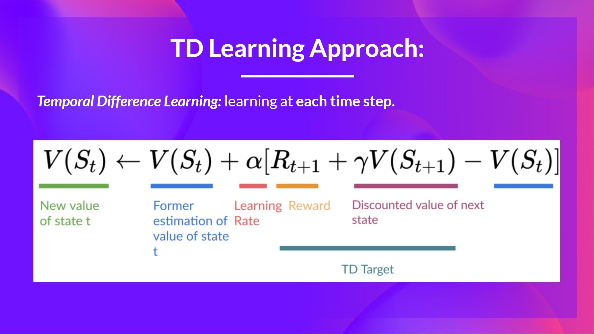

# What is RL

In RL, we build an agent that can make smart decisions.
To make intelligent decisions, our agent will learn from the environment by interacting with it through trial and error and receiving rewards (positive or negative) as unique feedback.

Its goal is to maximize its expected cumulative reward (because of the reward hypothesis).

The agent’s decision-making process is called the policy π: given a state, a policy will output an action or a probability distribution over actions. That is, given an observation of the environment, a policy will provide an action (or multiple probabilities for each action) that the agent should take.

Our goal is to find an optimal policy π* , aka., a policy that leads to the best expected cumulative reward.

And to find this optimal policy (hence solving the RL problem), there are two main types of RL methods:

- Policy-based methods: Train the policy directly to learn which action to take given a state.
- Value-based methods: Train a value function to learn which state is more valuable and use this value function to take the action that leads to it.

## Two types of value-based methods

The value of a state is the expected discounted return the agent can get if it starts at that state and then acts according to our policy.

To find the optimal policy, we learned about two different methods:

### Policy-based methods 

Directly train the policy to select what action to take given a state (or a probability distribution over actions at that state). In this case, we don’t have a value function.

The policy takes a state as input and outputs what action to take at that state (deterministic policy: a policy that output one action given a state, contrary to stochastic policy that output a probability distribution over actions).

And consequently, we don’t define by hand the behavior of our policy; it’s the training that will define it.

###  Value-based methods

Indirectly, by training a value function that outputs the value of a state or a state-action pair. Given this value function, our policy will take an action.

Since the policy is not trained/learned, we need to specify its behavior. For instance, if we want a policy that, given the value function, will take actions that always lead to the biggest reward, we’ll create a Greedy Policy.

### So the difference is:

In policy-based training, the optimal policy (denoted π*) is found by training the policy directly.

In value-based training, finding an optimal value function (denoted Q* or V*, we’ll study the difference below) leads to having an optimal policy.

### The state-value function

We write the state value function under a policy π like this:

For each state, the state-value function outputs the expected return if the agent starts at that state and then follows the policy forever afterward (for all future timesteps, if you prefer).

### The action-value function

In the action-value function, for each state and action pair, the action-value function outputs the expected return if the agent starts in that state, takes that action, and then follows the policy forever after.

The value of taking action a in state s under a policy π is:

We see that the difference is:

- For the state-value function, we calculate the value of a state St
- For the action-value function, we calculate the value of the state-action pair (St,At) hence the value of taking that action at that state.

In either case, whichever value function we choose (state-value or action-value function), the returned value is the expected return.

However, the problem is that to calculate EACH value of a state or a state-action pair, we need to sum all the rewards an agent can get if it starts at that state.

This can be a computationally expensive process, and that’s where the Bellman equation comes in to help us.

## The Bellman Equation

We know that if we calculate V(St) (the value of a state), we need to calculate the return starting at that state and then follow the policy forever after.

So to calculate V(St), we need to calculate the sum of the expected rewards. 

The Bellman equation is a recursive equation that works like this: instead of starting for each state from the beginning and calculating the return, we can consider the value of any state as: The immediate reward Rt+1 + the discounted value of the state that follows γ∗V(St+1).

The idea of the Bellman equation is that instead of calculating each value as the sum of the expected return, which is a long process, we calculate the value as the sum of immediate reward + the discounted value of the state that follows.

## Monte Carlo vs Temporal Difference Learning

Remember that an RL agent learns by interacting with its environment. The idea is that given the experience and the received reward, the agent will update its value function or policy.

Monte Carlo and Temporal Difference Learning are two different strategies on how to train our value function or our policy function. Both of them use experience to solve the RL problem.

On one hand, Monte Carlo uses an entire episode of experience before learning. On the other hand, Temporal Difference uses only a step (St,At,Rt+1,St+1) to learn.

### Monte Carlo: learning at the end of the episode

Monte Carlo waits until the end of the episode, calculates Gt(return) and uses it as a target for updating V(St).
So it requires a complete episode of interaction before updating our value function.

- We always start the episode at the same starting point.
- The agent takes actions using the policy. For instance, using an Epsilon Greedy Strategy, a policy that alternates between exploration (random actions) and exploitation.
- We get the reward and the next state.
- At the end of the episode, we have a list of State, Actions, Rewards, and Next States tuples. 
- The agent will sum the total rewards Gt
- It will then update V(st) based on the formula

- Then start a new game with this new knowledge.

### Temporal Difference Learning: learning at each step

Temporal Difference, on the other hand, waits for only one interaction (one step) St+1 to form a TD target and update V(St)
using Rt+1 and γ∗V(St+1).

The idea with TD is to update the V(St) at each step.

But because we didn’t experience an entire episode, we don’t have Gt (expected return). Instead, we estimate Gt by adding Rt+1 and the discounted value of the next state.

This is called bootstrapping. It’s called this because TD bases its update in part on an existing estimate V(St+1) and not a complete sample Gt.

To summarize:

With Monte Carlo, we update the value function from a complete episode, and so we use the actual accurate discounted return of this episode.

With TD Learning, we update the value function from a step, and we replace Gt, which we don’t know, with an estimated return called the TD target.
