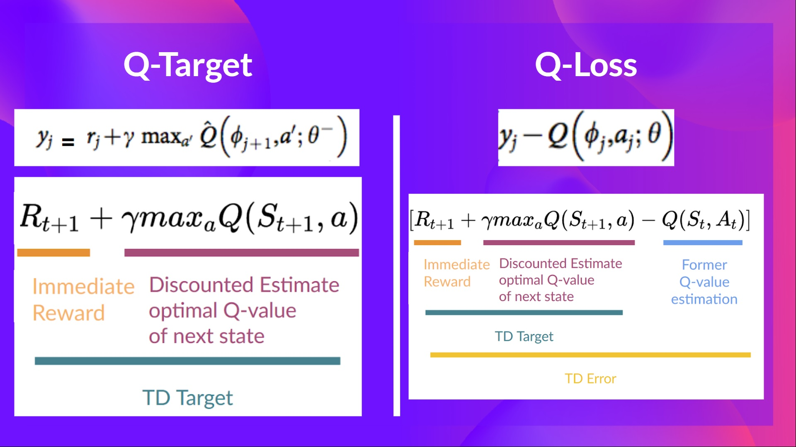
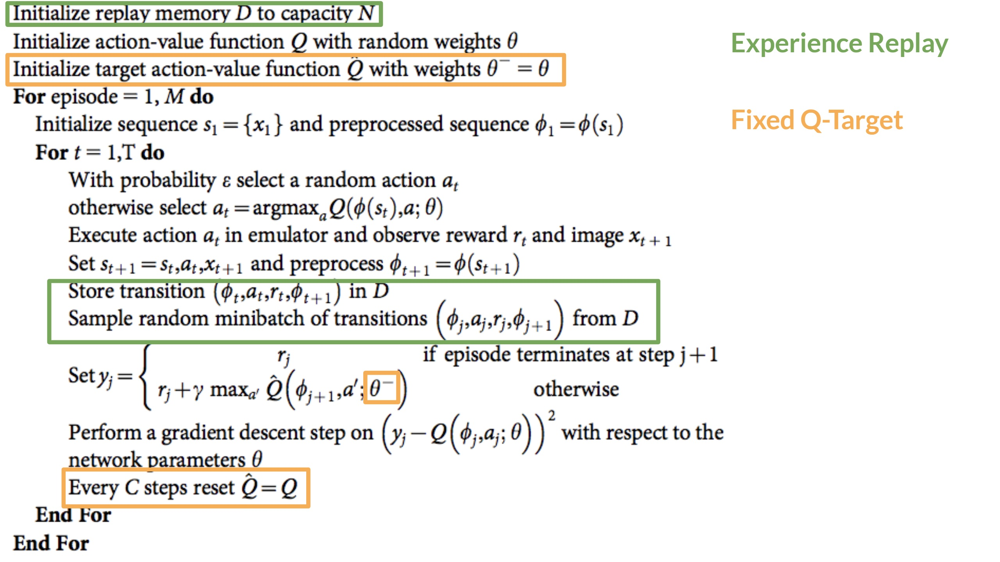

# DQN

The problem is that Q-Learning is a tabular method. This becomes a problem if the states and actions spaces are not small enough to be represented efficiently by arrays and tables. In other words: it is not scalable.

In this case, the best idea is to approximate the Q-values using a parametrized Q-function Qθ(s,a).

This neural network will approximate, given a state, the different Q-values for each possible action at that state. And that’s exactly what Deep Q-Learning does.

In Deep Q-Learning, we create a loss function that compares our Q-value prediction and the Q-target and uses gradient descent to update the weights of our Deep Q-Network to approximate our Q-values better.

The Deep Q-Learning training algorithm has two phases:

- Sampling: we perform actions and store the observed experience tuples in a replay memory.
- Training: Select a small batch of tuples randomly and learn from this batch using a gradient descent update step.

This is not the only difference compared with Q-Learning. Deep Q-Learning training might suffer from instability, mainly because of combining a non-linear Q-value function (Neural Network) and bootstrapping (when we update targets with existing estimates and not an actual complete return).

To help us stabilize the training, we implement three different solutions:

- Experience Replay to make more efficient use of experiences.
- Fixed Q-Target to stabilize the training.
- Double Deep Q-Learning, to handle the problem of the overestimation of Q-values.

## Experience Replay to make more efficient use of experiences

Experience Replay in Deep Q-Learning has two functions:

1. Make more efficient use of the experiences during the training. Usually, in online reinforcement learning, the agent interacts with the environment, gets experiences (state, action, reward, and next state), learns from them (updates the neural network), and discards them. This is not efficient.

Experience replay helps by using the experiences of the training more efficiently. We use a replay buffer that saves experience samples that we can reuse during the training.

This allows the agent to learn from the same experiences multiple times.

2. Avoid forgetting previous experiences (aka catastrophic interference, or catastrophic forgetting) and reduce the correlation between experiences.

- catastrophic forgetting: The problem we get if we give sequential samples of experiences to our neural network is that it tends to forget the previous experiences as it gets new experiences. For instance, if the agent is in the first level and then in the second, which is different, it can forget how to behave and play in the first level.

The solution is to create a Replay Buffer that stores experience tuples while interacting with the environment and then sample a small batch of tuples. This prevents the network from only learning about what it has done immediately before.

In the Deep Q-Learning pseudocode, we initialize a replay memory buffer D with capacity N (N is a hyperparameter that you can define). We then store experiences in the memory and sample a batch of experiences to feed the Deep Q-Network during the training phase.

## Fixed Q-Target to stabilize the training

When we want to calculate the TD error (aka the loss), we calculate the difference between the TD target (Q-Target) and the current Q-value (estimation of Q).

But we don’t have any idea of the real TD target. We need to estimate it. Using the Bellman equation, we saw that the TD target is just the reward of taking that action at that state plus the discounted highest Q value for the next state.

However, the problem is that we are using the same parameters (weights) for estimating the TD target and the Q-value. Consequently, there is a significant correlation between the TD target and the parameters we are changing.

Therefore, at every step of training, both our Q-values and the target values shift. We’re getting closer to our target, but the target is also moving. It’s like chasing a moving target! This can lead to significant oscillation in training.

Instead, what we see in the pseudo-code is that we:

- Use a separate network with fixed parameters for estimating the TD Target
- Copy the parameters from our Deep Q-Network every C steps to update the target network.

## Double DQN

- [Double Q-learning](https://papers.nips.cc/paper_files/paper/2010/hash/091d584fced301b442654dd8c23b3fc9-Abstract.html)

This method handles the problem of the overestimation of Q-values.

We face a simple problem by calculating the TD target: how are we sure that the best action for the next state is the action with the highest Q-value?

We know that the accuracy of Q-values depends on what action we tried and what neighboring states we explored.

Consequently, we don’t have enough information about the best action to take at the beginning of the training. Therefore, taking the maximum Q-value (which is noisy) as the best action to take can lead to false positives. If non-optimal actions are regularly given a higher Q value than the optimal best action, the learning will be complicated.

The solution is: when we compute the Q target, we use two networks to decouple the action selection from the target Q-value generation. We:

- Use our DQN network to select the best action to take for the next state (the action with the highest Q-value).
- Use our Target network to calculate the target Q-value of taking that action at the next state.

Therefore, Double DQN helps us reduce the overestimation of Q-values and, as a consequence, helps us train faster and with more stable learning.

Since these three improvements in Deep Q-Learning, many more have been added, such as Prioritized Experience Replay and Dueling Deep Q-Learning. They’re out of the scope of this course but if you’re interested, check the links we put in the reading list.

