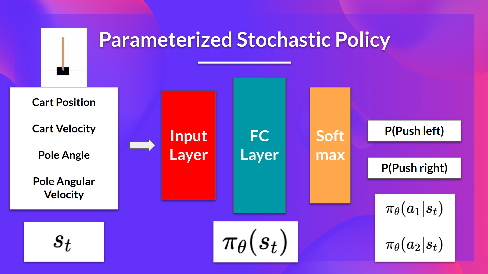

# Gradient Policy

In policy-based methods, we directly learn to approximate π∗  without having to learn a value function.

The idea is to parameterize the policy. For instance, using a neural network πθ, this policy will output a probability distribution over actions (stochastic policy).

Our objective then is to maximize the performance of the parameterized policy using gradient ascent.

To do that, we control the parameter θ that will affect the distribution of actions over a state.

Consequently, thanks to policy-based methods, we can directly optimize our policy πθ to output a probability distribution over actions πθ(a∣s) that leads to the best cumulative return. 

To do that, we define an objective function J(θ), that is, the expected cumulative reward, and we want to find the value θ that maximizes this objective function.

## The difference between policy-based and policy-gradient methods

Policy-gradient methods is a subclass of policy-based methods. 

In policy-based methods, the optimization is most of the time on-policy since for each update, we only use data (trajectories) collected by our most recent version of πθ.

The difference between these two methods lies on how we optimize the parameter θ:

- In policy-based methods, we search directly for the optimal policy. We can optimize the parameter θ indirectly by maximizing the local approximation of the objective function with techniques like hill climbing, simulated annealing, or evolution strategies.
- In policy-gradient methods, because it is a subclass of the policy-based methods, we search directly for the optimal policy. But we optimize the parameter θ directly by performing the gradient ascent on the performance of the objective function J(θ).

## The advantages and disadvantages of policy-gradient methods

### Advantages

#### The simplicity of integration 

We can estimate the policy directly without storing additional data (action values).

#### Policy-gradient methods can learn a stochastic policy

Policy-gradient methods can learn a stochastic policy while value functions can’t.

This has two consequences:

- We don’t need to implement an exploration/exploitation trade-off by hand. Since we output a probability distribution over actions, the agent explores the state space without always taking the same trajectory.
- We also get rid of the problem of perceptual aliasing. Perceptual aliasing is when two states seem (or are) the same but need different actions.

#### Policy-gradient methods are more effective in high-dimensional action spaces and continuous actions spaces.

The problem with Deep Q-learning is that their predictions assign a score (maximum expected future reward) for each possible action, at each time step, given the current state.
But what if we have an infinite possibility of actions? Instead, with policy-gradient methods, we output a probability distribution over actions.

#### Policy-gradient methods have better convergence properties

In value-based methods, we use an aggressive operator to change the value function: we take the maximum over Q-estimates. 
Consequently, the action probabilities may change dramatically for an arbitrarily small change in the estimated action values if that change results in a different action having the maximal value.

On the other hand, in policy-gradient methods, stochastic policy action preferences (probability of taking action) change smoothly over time.

### Disadvantages

Naturally, policy-gradient methods also have some disadvantages:

- Frequently, policy-gradient methods converges to a local maximum instead of a global optimum.
- Policy-gradient goes slower, step by step: it can take longer to train (inefficient).
- Policy-gradient can have high variance.

## Diving deeper into policy-gradient methods

Our goal with policy-gradient is to control the probability distribution of actions by tuning the policy such that good actions (that maximize the return) are sampled more frequently in the future. 
Each time the agent interacts with the environment, we tweak the parameters such that good actions will be sampled more likely in the future.

But how are we going to optimize the weights using the expected return?

The idea is that we’re going to let the agent interact during an episode. 
And if we win the episode, we consider that each action taken was good and must be more sampled in the future since they lead to win.

So for each state-action pair, we want to increase the P(a∣s): the probability of taking that action at that state. Or decrease if we lost.

The Policy-gradient algorithm (simplified) looks like this:

We have our stochastic policy π which has a parameter θ. This π,  given a state, outputs a probability distribution of actions.
Where πθ(at∣st) is the probability of the agent selecting action at from state st given our policy.
But how do we know if our policy is good? We need to have a way to measure it. 
To know that, we define a score/objective function called J(θ).

### The objective function

The objective function gives us the performance of the agent given a trajectory (state action sequence without considering reward (contrary to an episode)), and it outputs the expected cumulative reward.

The expected return (also called expected cumulative reward), is the weighted average (where the weights are given by P(τ;θ) of all possible values that the return R(τ) can take).

- R(τ): Return from an arbitrary trajectory. To take this quantity and use it to calculate the expected return, we need to multiply it by the probability of each possible trajectory.
- P(τ;θ): Probability of each possible trajectory τ (that probability depends on θ since it defines the policy that it uses to select the actions of the trajectory which has an impact of the states visited).

- J(θ): Expected return, we calculate it by summing for all trajectories, the probability of taking that trajectory given θ multiplied by the return of this trajectory.

Our objective then is to maximize the expected cumulative reward by finding the θthat will output the best action probability distributions:

## Gradient Ascent and the Policy-gradient Theorem

Policy-gradient is an optimization problem: we want to find the values of θ that maximize our objective function J(θ), so we need to use gradient-ascent. 
It’s the inverse of gradient-descent since it gives the direction of the steepest increase of J(θ).

Our update step for gradient-ascent is: θ ← θ + α ∗ ∇θJ(θ)

We can repeatedly apply this update in the hopes that θ converges to the value that maximizes J(θ).

However, there are two problems with computing the derivative of J(θ):

1. We can’t calculate the true gradient of the objective function since it requires calculating the probability of each possible trajectory, which is computationally super expensive. 
So we want to calculate a gradient estimation with a sample-based estimate (collect some trajectories).

2. To differentiate this objective function, we need to differentiate the state distribution, called the Markov Decision Process dynamics. This is attached to the environment. 
It gives us the probability of the environment going into the next state, given the current state and the action taken by the agent. The problem is that we can’t differentiate it because we might not know about it.

Fortunately we’re going to use a solution called the Policy Gradient Theorem that will help us to reformulate the objective function into a differentiable function that does not involve the differentiation of the state distribution.

## The Reinforce algorithm (Monte Carlo Reinforce)

The Reinforce algorithm, also called Monte-Carlo policy-gradient, is a policy-gradient algorithm that uses an estimated return from an entire episode to update the policy parameter θ:

In a loop:

- Use the policy πθ  to collect an episode τ
- Use the episode to estimate the gradient g^ = ∇θJ(θ)

- Update the weights of the policy: θ ← θ + αg^

We can interpret this update as follows:

- ∇θlogπθ(at∣st) is the direction of steepest increase of the (log) probability of selecting action at from state st. 
This tells us how we should change the weights of policy if we want to increase/decrease the log probability of selecting action at at state st.

- R(τ): is the scoring function:
  - If the return is high, it will push up the probabilities of the (state, action) combinations.
  - Otherwise, if the return is low, it will push down the probabilities of the (state, action) combinations.

We can also collect multiple episodes (trajectories) to estimate the gradient:

## Reinforce Training Algorithm

- When we calculate the return Gt (line 6), we see that we calculate the sum of discounted rewards starting at timestep t.
- Why? Because our policy should only reinforce actions on the basis of the consequences: so rewards obtained before taking an action are useless (since they were not because of the action), only the ones that come after the action matters.

- [Don’t Let the Past Distract You](https://spinningup.openai.com/en/latest/spinningup/rl_intro3.html#don-t-let-the-past-distract-you)
- 

