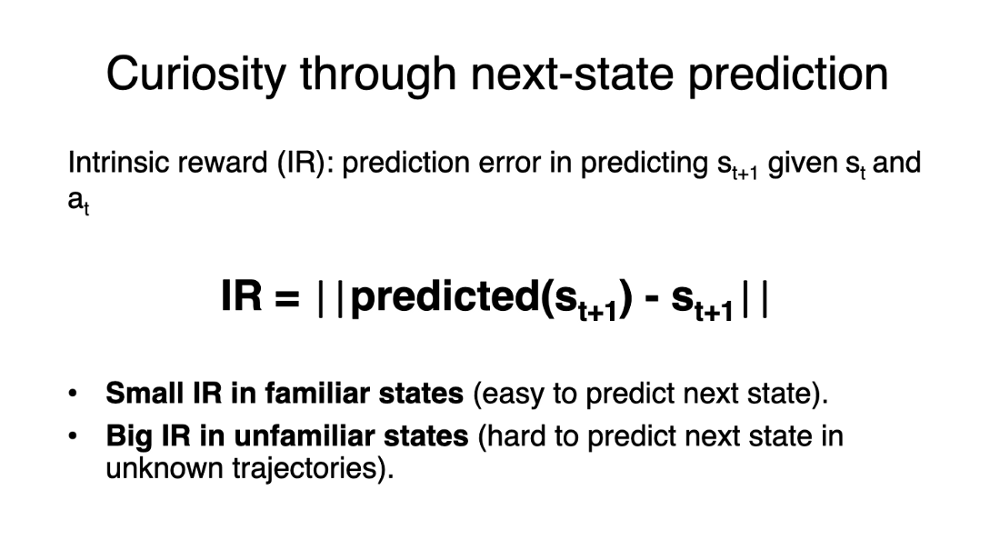
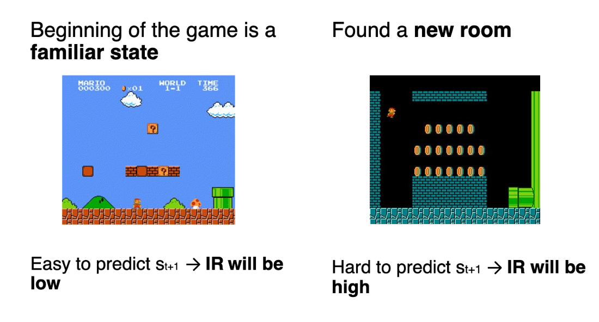

# Curiosity in Deep Reinforcement Learning

- [Curiosity-Driven Learning Through Next State Prediction](https://blog.dataiku.com/curiosity-driven-learning-through-next-state-prediction)
- [Using State Predictions for Value Regularization in Curiosity Driven Deep Reinforcement Learning](https://arxiv.org/abs/1810.00361)
- [Curiosity-Driven Reinforcement Learning from Human Feedback](https://arxiv.org/html/2501.11463v1)
- [Curiosity-driven Exploration by Self-supervised Prediction](https://pathak22.github.io/noreward-rl/resources/icml17.pdf)

## Two Major Problems in Modern RL

First, the sparse rewards problem: that is, most rewards do not contain information, and hence are set to zero.

Remember that RL is based on the reward hypothesis, which is the idea that each goal can be described as the maximization of the rewards. 
Therefore, rewards act as feedback for RL agents; if they don’t receive any, their knowledge of which action is appropriate (or not) cannot change.

The second big problem is that the extrinsic reward function is handmade; in each environment, a human has to implement a reward function. 
But how we can scale that in big and complex environments?

## So what is Curiosity?

A solution to these problems is to develop a reward function intrinsic to the agent, i.e., generated by the agent itself. The agent will act as a self-learner since it will be the student and its own feedback master.

This intrinsic reward mechanism is known as Curiosity because this reward pushes the agent to explore states that are novel/unfamiliar. To achieve that, our agent will receive a high reward when exploring new trajectories.

This reward is inspired by how humans act. We naturally have an intrinsic desire to explore environments and discover new things.

There are different ways to calculate this intrinsic reward. The classical approach (Curiosity through next-state prediction) is to calculate Curiosity as the error of our agent in predicting the next state, given the current state and action taken.

Because the idea of Curiosity is to encourage our agent to perform actions that reduce the uncertainty in the agent’s ability to predict the consequences of its actions (uncertainty will be higher in areas where the agent has spent less time or in areas with complex dynamics).

If the agent spends a lot of time on these states, it will be good at predicting the next state (low Curiosity). On the other hand, if it’s in a new, unexplored state, it will be hard to predict the following state (high Curiosity).

Using Curiosity will push our agent to favor transitions with high prediction error (which will be higher in areas where the agent has spent less time, or in areas with complex dynamics) and consequently better explore our environment.

There’s also other curiosity calculation methods. ML-Agents uses a more advanced one called Curiosity through random network distillation. 

- [Random Network Distillation: A New Take on Curiosity-Driven Learning](https://blog.dataiku.com/random-network-distillation-a-new-take-on-curiosity-driven-learning)
- [Exploration by Random Network Distillation](https://arxiv.org/abs/1810.12894)
- [RLeXplore](https://github.com/RLE-Foundation/RLeXplore)
- [Random Network Distillation](https://github.com/jcwleo/random-network-distillation-pytorch)

