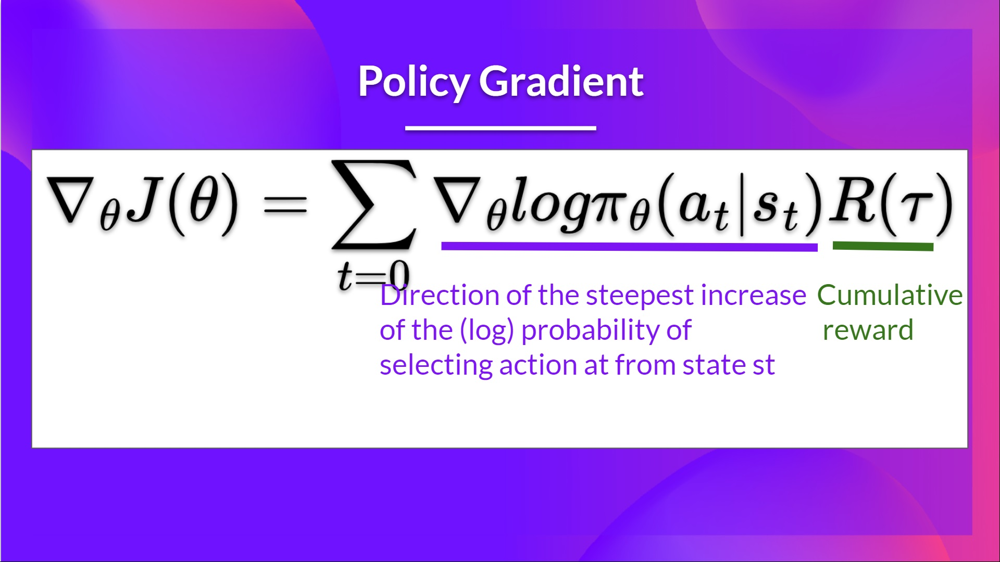
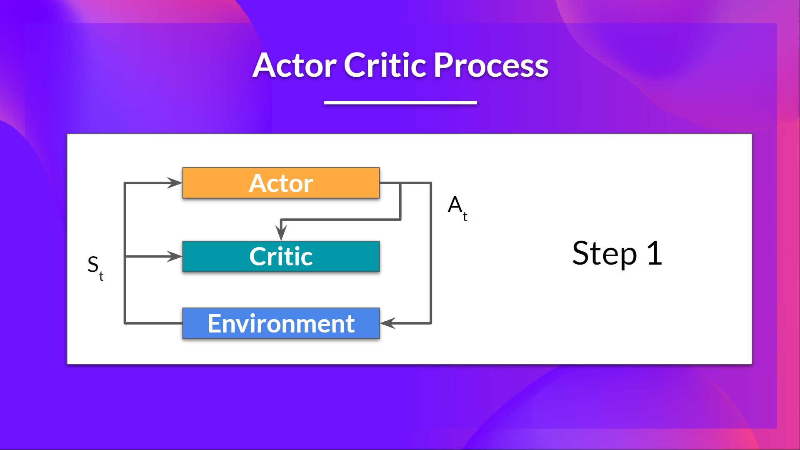
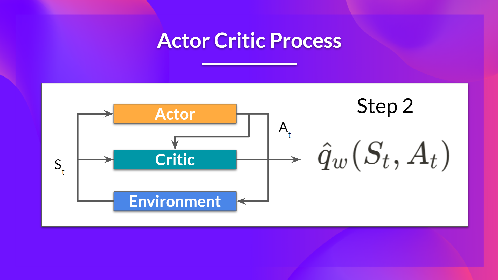
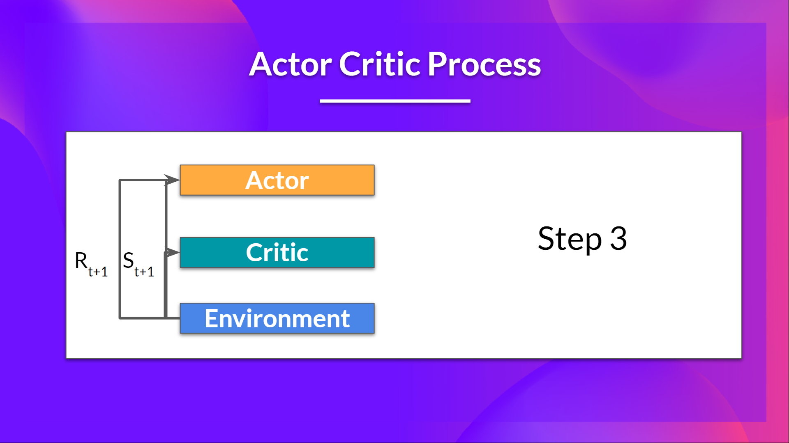
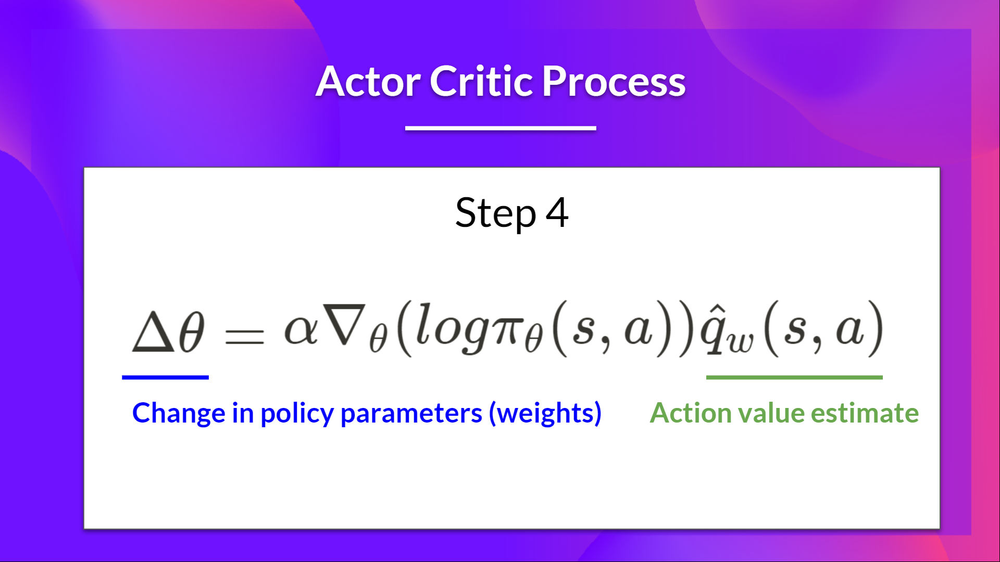
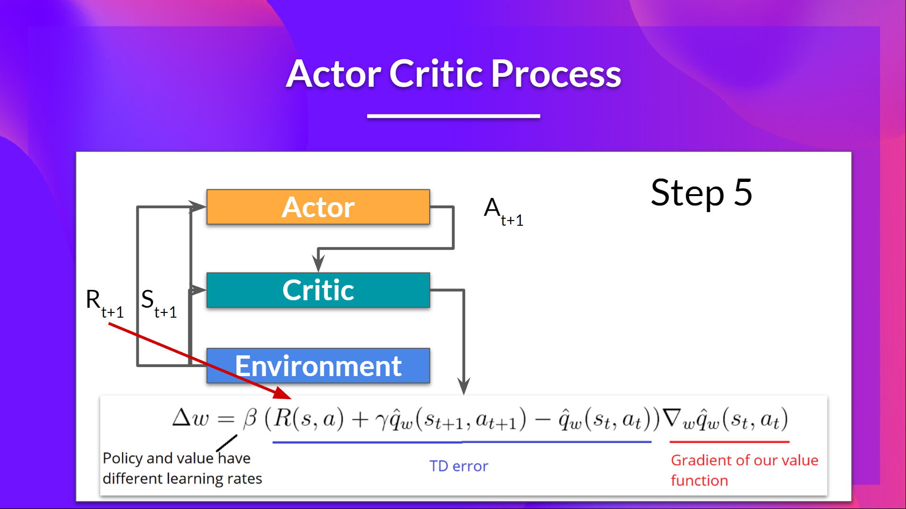
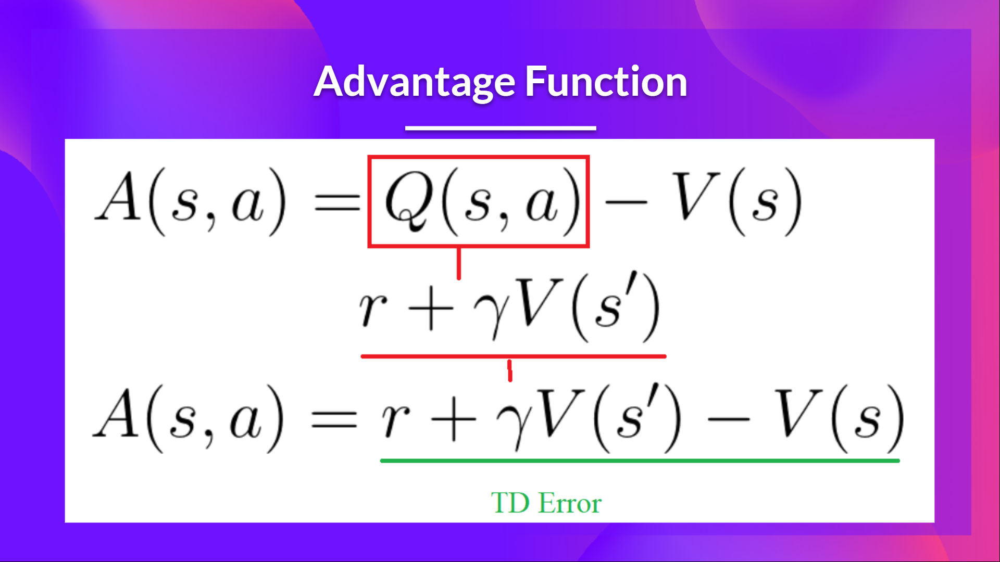

# Actor-Critic

In Policy-Based methods, we aim to optimize the policy directly without using a value function. 
More precisely, Reinforce is part of a subclass of Policy-Based Methods called Policy-Gradient methods. 
This subclass optimizes the policy directly by estimating the weights of the optimal policy using Gradient Ascent.

We saw that Reinforce worked well. 
However, because we use Monte-Carlo sampling to estimate return (we use an entire episode to calculate the return), we have significant variance in policy gradient estimation.

Remember that the policy gradient estimation is the direction of the steepest increase in return. 
In other words, how to update our policy weights so that actions that lead to good returns have a higher probability of being taken. 
The Monte Carlo variance, which we will further study in this unit, leads to slower training since we need a lot of samples to mitigate it.

Actor-Critic methods - a hybrid architecture combining value-based and Policy-Based methods that helps to stabilize the training by reducing the variance using:

- An Actor that controls how our agent behaves (Policy-Based method)
- A Critic that measures how good the taken action is (Value-Based method)

## The Problem of Variance in Reinforce

In Reinforce, we want to increase the probability of actions in a trajectory proportionally to how high the return is.

If the return is high, we will push up the probabilities of the (state, action) combinations.
Otherwise, if the return is low, it will push down the probabilities of the (state, action) combinations.
This return R(τ) is calculated using a Monte-Carlo sampling. We collect a trajectory and calculate the discounted return, and use this score to increase or decrease the probability of every action taken in that trajectory. 
If the return is good, all actions will be “reinforced” by increasing their likelihood of being taken. 

R(τ)=Rt+1 + γRt+2 + γ2Rt+3 +...

The advantage of this method is that it’s unbiased. Since we’re not estimating the return, we use only the true return we obtain.

Given the stochasticity of the environment (random events during an episode) and stochasticity of the policy, trajectories can lead to different returns, which can lead to high variance. 
Consequently, the same starting state can lead to very different returns. 
Because of this, the return starting at the same state can vary significantly across episodes.

The solution is to mitigate the variance by using a large number of trajectories, hoping that the variance introduced in any one trajectory will be reduced in aggregate and provide a “true” estimation of the return.

However, increasing the batch size significantly reduces sample efficiency. So we need to find additional mechanisms to reduce the variance.

## Articles

- [Making Sense of the Bias / Variance Trade-off in (Deep) Reinforcement Learning](https://blog.mlreview.com/making-sense-of-the-bias-variance-trade-off-in-deep-reinforcement-learning-79cf1e83d565)
- [Bias-variance Tradeoff in Reinforcement Learning](https://www.endtoend.ai/blog/bias-variance-tradeoff-in-reinforcement-learning/)
- [High Variance in Policy gradients](https://balajiai.github.io/high_variance_in_policy_gradients)

## Advantage Actor-Critic (A2C)

We learn two function approximations:

- A policy that controls how our agent acts: πθ(s)
- A value function to assist the policy update by measuring how good the action taken is: q^w(s,a)

### The Actor-Critic Process

Now that we have seen the Actor Critic’s big picture, let’s dive deeper to understand how the Actor and Critic improve together during the training.

As we saw, with Actor-Critic methods, there are two function approximations (two neural networks):

- Actor, a policy function parameterized by theta: πθ(s)
- Critic, a value function parameterized by w: q^w(s,a)

Let’s see the training process to understand how the Actor and Critic are optimized:

- At each timestep, t, we get the current state St  from the environment and pass it as input through our Actor and Critic.
- Our Policy takes the state and outputs an action At.

- The Critic takes that action also as input and, using St  and At, computes the value of taking that action at that state: the Q-value.

- The action At performed in the environment outputs a new state St+1 and a reward Rt+1.

- The Actor updates its policy parameters using the Q value.

- Thanks to its updated parameters, the Actor produces the next action to take at At+1 given the new state St+1.
- The Critic then updates its value parameters.

### Adding Advantage in Actor-Critic (A2C)

We can stabilize learning further by using the Advantage function as Critic instead of the Action value function.

The idea is that the Advantage function calculates the relative advantage of an action compared to the others possible at a state: how taking that action at a state is better compared to the average value of the state. 
It’s subtracting the mean value of the state from the state action pair:

In other words, this function calculates the extra reward we get if we take this action at that state compared to the mean reward we get at that state.
The extra reward is what’s beyond the expected value of that state.

- If A(s,a) > 0: our gradient is pushed in that direction.
0 If A(s,a) < 0 (our action does worse than the average value of that state), our gradient is pushed in the opposite direction.

The problem with implementing this advantage function is that it requires two value functions — Q(s,a) and  V(s). 

Fortunately, we can use the TD error as a good estimator of the advantage function.

## Resources

- [Bias-variance Tradeoff in Reinforcement Learning](https://www.endtoend.ai/blog/bias-variance-tradeoff-in-reinforcement-learning/)
- [Asynchronous Methods for Deep Reinforcement Learning](https://arxiv.org/abs/1602.01783v2)
- 