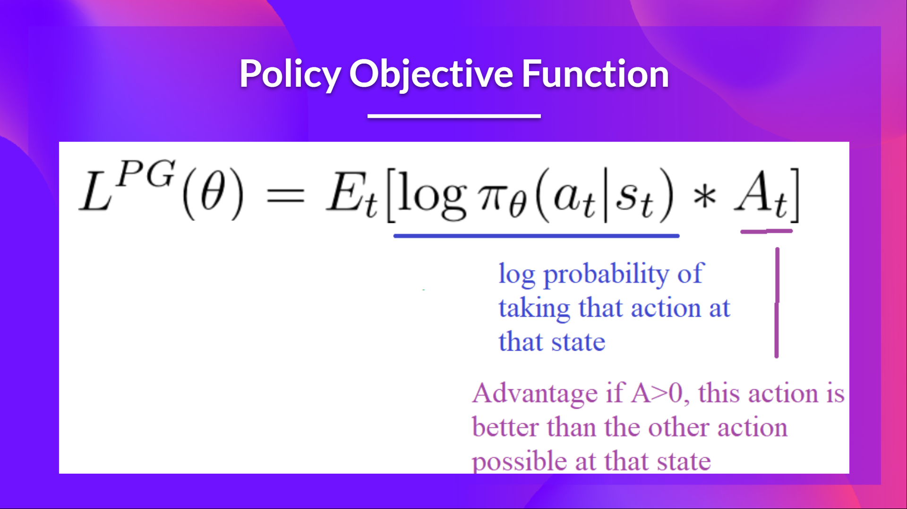

# Proximal Policy Optimization (PPO)

Actor Critic (A2C), a hybrid architecture combining value-based and policy-based methods that helps to stabilize the training by reducing the variance with:

- An Actor that controls how our agent behaves (policy-based method).
- A Critic that measures how good the action taken is (value-based method).

Proximal Policy Optimization (PPO) - an architecture that improves our agent’s training stability by avoiding policy updates that are too large. 
To do that, we use a ratio that indicates the difference between our current and old policy and clip this ratio to a specific range [1−ϵ,1+ϵ].

## The intuition behind PPO

The idea with Proximal Policy Optimization (PPO) is that we want to improve the training stability of the policy by limiting the change you make to the policy at each training epoch: we want to avoid having too large of a policy update.

For two reasons:

- We know empirically that smaller policy updates during training are more likely to converge to an optimal solution.
- A too-big step in a policy update can result in falling “off the cliff” (getting a bad policy) and taking a long time or even having no possibility to recover.

So with PPO, we update the policy conservatively. 
To do so, we need to measure how much the current policy changed compared to the former one using a ratio calculation between the current and former policy. And we clip this ratio in a range [1−ϵ,1+ϵ], meaning that we remove the incentive for the current policy to go too far from the old one (hence the proximal policy term).

## Introducing the Clipped Surrogate Objective Function

### Recap: The Policy Objective Function

Let’s remember what the objective is to optimize in Reinforce:

The idea was that by taking a gradient ascent step on this function (equivalent to taking gradient descent of the negative of this function), we would push our agent to take actions that lead to higher rewards and avoid harmful actions.

However, the problem comes from the step size:

- Too small, the training process was too slow
- Too high, there was too much variability in the training

- With PPO, the idea is to constrain our policy update with a new objective function called the Clipped surrogate objective function that will constrain the policy change in a small range using a clip.

This new function is designed to avoid destructively large weights updates :

### The Ratio Function

This ratio is calculated as follows:

It’s the probability of taking action at at state st in the current policy, divided by the same for the previous policy.

As we can see, rt(θ) denotes the probability ratio between the current and old policy:

- If rt(θ)>1, the action at at state st is more likely in the current policy than the old policy.
- If rt(θ) is between 0 and 1, the action is less likely for the current policy than for the old one.

So this probability ratio is an easy way to estimate the divergence between old and current policy.

### The unclipped part of the Clipped Surrogate Objective function

This ratio can replace the log probability we use in the policy objective function. 
This gives us the left part of the new objective function: multiplying the ratio by the advantage.

However, without a constraint, if the action taken is much more probable in our current policy than in our former, this would lead to a significant policy gradient step and, therefore, an excessive policy update.

### The clipped Part of the Clipped Surrogate Objective function

Consequently, we need to constrain this objective function by penalizing changes that lead to a ratio far away from 1 (in the paper, the ratio can only vary from 0.8 to 1.2).

By clipping the ratio, we ensure that we do not have a too large policy update because the current policy can’t be too different from the older one.

To do that, we have two solutions:

- TRPO (Trust Region Policy Optimization) uses KL divergence constraints outside the objective function to constrain the policy update. But this method is complicated to implement and takes more computation time.
- PPO clip probability ratio directly in the objective function with its Clipped surrogate objective function.

This clipped part is a version where rt(θ) is clipped between [1−ϵ,1+ϵ].

With the Clipped Surrogate Objective function, we have two probability ratios, one non-clipped and one clipped in a range between [1−ϵ,1+ϵ], epsilon is a hyperparameter that helps us to define this clip range (in the paper ϵ=0.2.).

Then, we take the minimum of the clipped and non-clipped objective, so the final objective is a lower bound (pessimistic bound) of the unclipped objective.

Taking the minimum of the clipped and non-clipped objective means we’ll select either the clipped or the non-clipped objective based on the ratio and advantage situation.

### Sources

- [Proximal Policy Optimization Algorithms](https://arxiv.org/pdf/1707.06347)
- [Towards Delivering a Coherent Self-Contained Explanation of Proximal Policy Optimization](https://fse.studenttheses.ub.rug.nl/25709/1/mAI_2021_BickD.pdf)

## Visualize the Clipped Surrogate Objective Function

We have six different situations. Remember first that we take the minimum between the clipped and unclipped objectives.

### Case 1 and 2: the ratio is between the range

In situations 1 and 2, the clipping does not apply since the ratio is between the range [1−ϵ,1+ϵ]

In situation 1, we have a positive advantage: the action is better than the average of all the actions in that state. Therefore, we should encourage our current policy to increase the probability of taking that action in that state.

Since the ratio is between intervals, we can increase our policy’s probability of taking that action at that state.

In situation 2, we have a negative advantage: the action is worse than the average of all actions at that state. Therefore, we should discourage our current policy from taking that action in that state.

Since the ratio is between intervals, we can decrease the probability that our policy takes that action at that state.

### Case 3 and 4: the ratio is below the range

If the probability ratio is lower than [1−ϵ], the probability of taking that action at that state is much lower than with the old policy.

If, like in situation 3, the advantage estimate is positive (A>0), then you want to increase the probability of taking that action at that state.

But if, like situation 4, the advantage estimate is negative, we don’t want to decrease further the probability of taking that action at that state. Therefore, the gradient is = 0 (since we’re on a flat line), so we don’t update our weights.

### Case 5 and 6: the ratio is above the range

If the probability ratio is higher than [1+ϵ], the probability of taking that action at that state in the current policy is much higher than in the former policy.

If, like in situation 5, the advantage is positive, we don’t want to get too greedy. We already have a higher probability of taking that action at that state than the former policy. Therefore, the gradient is = 0 (since we’re on a flat line), so we don’t update our weights.

If, like in situation 6, the advantage is negative, we want to decrease the probability of taking that action at that state.

So if we recap, we only update the policy with the unclipped objective part. 
When the minimum is the clipped objective part, we don’t update our policy weights since the gradient will equal 0.

So we update our policy only if:

- Our ratio is in the range [1−ϵ,1+ϵ]
- Our ratio is outside the range, but the advantage leads to getting closer to the range
  - Being below the ratio but the advantage is > 0
  - Being above the ratio but the advantage is < 0

You might wonder why, when the minimum is the clipped ratio, the gradient is 0. When the ratio is clipped, the derivative in this case will not be the derivative of the rt(θ)∗At but the derivative of either
(1−ϵ)∗At or the derivative of (1+ϵ)∗At which both = 0.

To summarize, thanks to this clipped surrogate objective, we restrict the range that the current policy can vary from the old one. 
Because we remove the incentive for the probability ratio to move outside of the interval since the clip forces the gradient to be zero. 
If the ratio is > 1+ϵ or < 1 −ϵ the gradient will be equal to 0.

The final Clipped Surrogate Objective Loss for PPO Actor-Critic style looks like this, it’s a combination of Clipped Surrogate Objective function, Value Loss Function and Entropy bonus:

## Resources

- [The 37 Implementation Details of Proximal Policy Optimization](https://iclr-blog-track.github.io/2022/03/25/ppo-implementation-details/)
- [Proximal Policy Optimization](https://spinningup.openai.com/en/latest/algorithms/ppo.html)
- [Proximal Policy Optimization](https://openai.com/index/openai-baselines-ppo/)
- [What is the way to understand Proximal Policy Optimization Algorithm in RL?](https://stackoverflow.com/questions/46422845/what-is-the-way-to-understand-proximal-policy-optimization-algorithm-in-rl)

