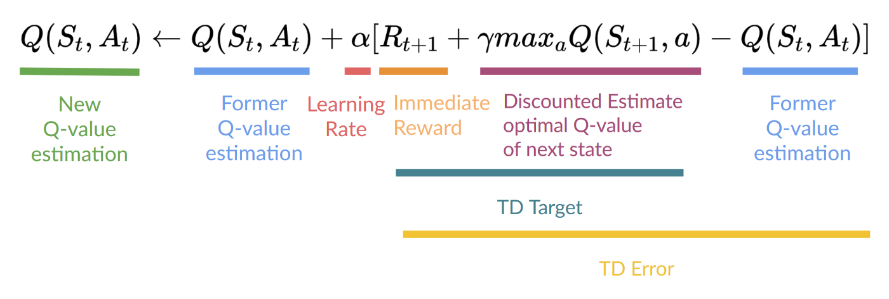
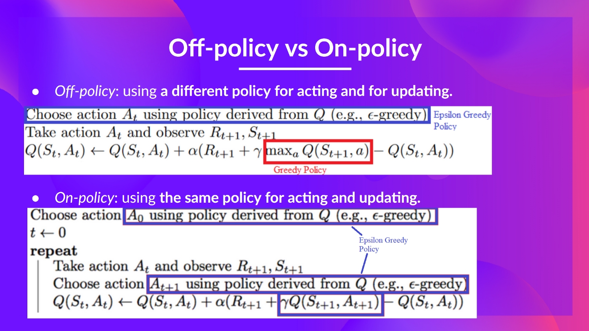

# Q-Learning

Q-Learning is an off-policy value-based method that uses a TD approach to train its action-value function:

Q-Learning is the algorithm we use to train our Q-function, an action-value function that determines the value of being at a particular state and taking a specific action at that state.

Internally, our Q-function is encoded by a Q-table, a table where each cell corresponds to a state-action pair value.

Given a state and action, our Q-function will search inside its Q-table to output the value.

## The Q-Learning algorithm

- Step 1: We initialize the Q-table
- Step 2: Choose an action using the epsilon-greedy strategy

### The epsilon-greedy strategy

The epsilon-greedy strategy is a policy that handles the exploration/exploitation trade-off.

The idea is that, with an initial value of ɛ = 1.0:

- With probability 1 — ɛ : we do exploitation (aka our agent selects the action with the highest state-action pair value).
- With probability ɛ: we do exploration (trying random action).

At the beginning of the training, the probability of doing exploration will be huge since ɛ is very high, so most of the time, we’ll explore. But as the training goes on, and consequently our Q-table gets better and better in its estimations, we progressively reduce the epsilon value since we will need less and less exploration and more exploitation.

- Step 3: Perform action At, get reward Rt+1 and next state St+1
- Step 4: Update Q(St, At)

To produce our TD target, we used the immediate reward Rt+1 plus the discounted value of the next state, computed by finding the action that maximizes the current Q-function at the next state. (We call that bootstrap).

This means that to update our Q(St,At): 

- We need St,At,Rt+1,St+1.
- To update our Q-value at a given state-action pair, we use the TD target.
  
How do we form the TD target?

- We obtain the reward Rt+1  after taking the action At.
- To get the best state-action pair value for the next state, we use a greedy policy to select the next best action. Note that this is not an epsilon-greedy policy, this will always take the action with the highest state-action value.
  
Then when the update of this Q-value is done, we start in a new state and select our action using a epsilon-greedy policy again.

### Off-policy vs On-policy

The difference is subtle:

- Off-policy: using a different policy for acting (inference) and updating (training).
For instance, with Q-Learning, the epsilon-greedy policy (acting policy), is different from the greedy policy that is used to select the best next-state action value to update our Q-value (updating policy).

- On-policy: using the same policy for acting and updating.
For instance, with Sarsa, another value-based algorithm, the epsilon-greedy policy selects the next state-action pair, not a greedy policy.

- [Why do temporal difference (TD) methods have lower variance than Monte Carlo methods?](https://stats.stackexchange.com/questions/355820/why-do-temporal-difference-td-methods-have-lower-variance-than-monte-carlo-met)
- [When are Monte Carlo methods preferred over temporal difference ones?](https://stats.stackexchange.com/questions/336974/when-are-monte-carlo-methods-preferred-over-temporal-difference-ones)

